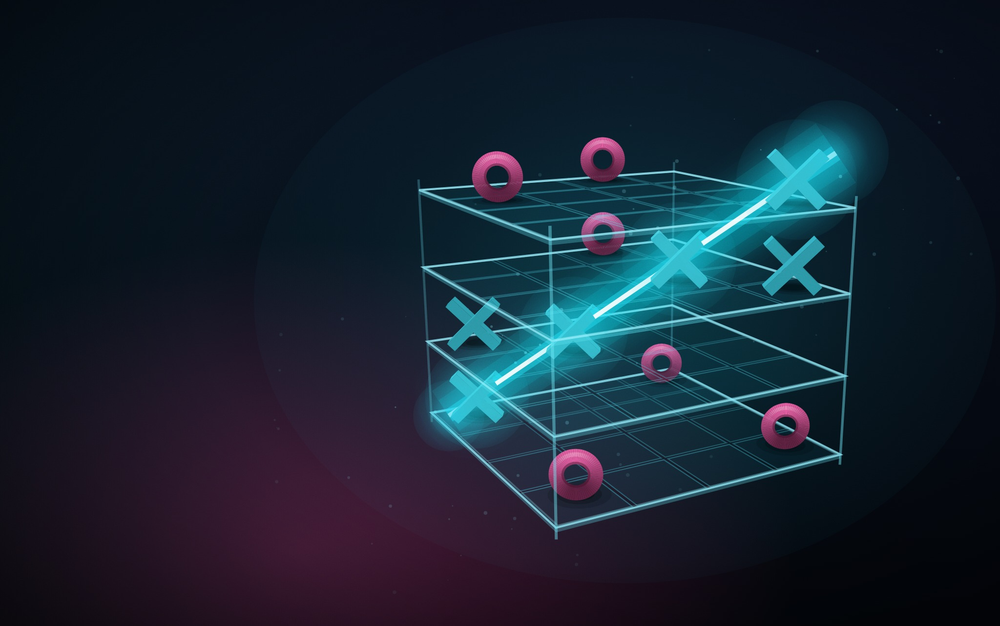
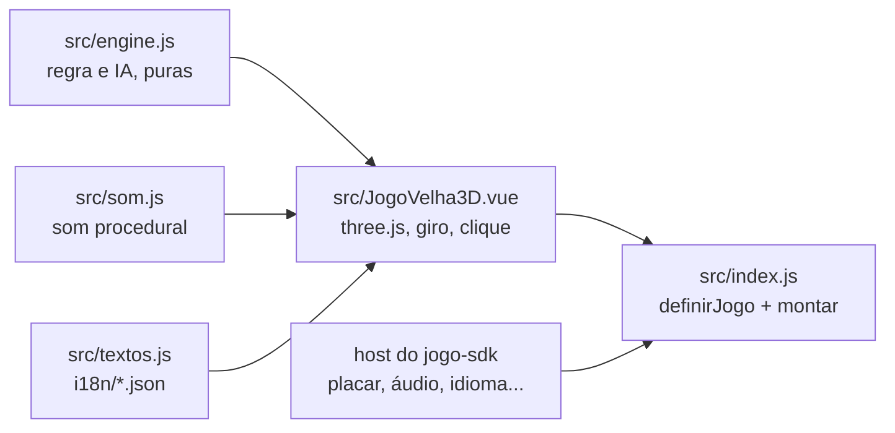

# Velha 3D

O jogo da velha em 3D do [RoqueOS](https://roqueos.com.br): um cubo de 4×4×4 contra a IA, e
vence quem alinhar quatro em qualquer direção do espaço. Jogue em
[roqueos.com.br/jogar/jogo-da-velha-3d](https://roqueos.com.br/jogar/jogo-da-velha-3d).

_English below._

## Por que existe

Até 25/09/2026 este jogo morava dentro do repositório do RoqueOS e importava as stores do
sistema direto. Agora ele é um repo próprio na organização
[roqueos-games](https://github.com/roqueos-games), aberto, e fala com o RoqueOS só pelo
[`jogo-sdk`](https://github.com/roqueos-games/jogo-sdk). O mesmo código roda no RoqueOS,
sozinho no seu navegador (`yarn dev`) e no teste.

## Como se joga

Escolha a dificuldade e clique numa casa do cubo. A IA responde em seguida. Vale linha reta
de quatro em qualquer direção: nas fileiras de cada plano, nas colunas em profundidade, nas
diagonais das faces e nas quatro diagonais que atravessam o cubo inteiro. São 76 linhas.

| Ação              | Ponteiro (mouse ou toque)             |
| ----------------- | ------------------------------------- |
| marcar uma casa   | clique ou toque sem arrastar          |
| girar o cubo      | arraste                               |
| voltar ao menu    | botão de grade, no canto              |
| ligar e tirar som | botão de alto-falante, no canto       |
| jogar de novo     | "Jogar de novo", na mesma dificuldade |

O jogo não usa teclado. O recorde é o número de vitórias contra a IA.

A IA tem três níveis. No Fácil ela fecha a própria linha quando pode, bloqueia a sua metade
das vezes e no resto joga perto das marcas que já estão no cubo. No Médio ela sempre
bloqueia, arma e desarma garfos (duas ameaças de uma vez) e, fora disso, escolhe a casa que
mais favorece as linhas que ela ainda pode fechar. No Difícil ela olha também a sua melhor
resposta antes de jogar.

## Arquitetura

- `src/engine.js` é a regra do jogo e a IA, sem Vue, sem DOM e sem `Math.random`: o cubo, as
  76 linhas e a escolha de lance. O sorteio do Fácil vem de uma semente, então todo lance é
  reproduzível no teste.
- `src/JogoVelha3D.vue` desenha o cubo com [three.js](https://threejs.org), gira com o
  arraste e acha a casa clicada por raio. Tudo o que vem do sistema (vitórias da conta,
  áudio, perfil de aparelho fraco, métrica, idioma) chega pelo `host`. No perfil leve o jogo
  nasce sem antialias, com pixel ratio menor, sem desfoque atrás do resultado, e a IA pensa
  menos.
- `src/index.js` cria um app Vue próprio dentro do elemento que o host entrega e devolve
  `{ ativar, desmontar }`. A janela sem foco para de desenhar; desmontar solta o laço, os
  ouvintes, os materiais e o contexto WebGL.
- `jogo.json` é o manifesto: nome e descrição nos dez idiomas, SEO, etiquetas, capa, ícone,
  tamanho de janela e a chave do recorde. O RoqueOS confere que ele bate com o catálogo.

O `three` é `peerDependency`: o RoqueOS fornece o dele, e o jogo não traz outro. A versão exata
em `devDependencies` é a mesma que o RoqueOS instala, para o teste e o `yarn dev` verem o que
o jogador vê.

## Pré-requisitos

- Node 24 (o `.nvmrc` diz), ou 22 no mínimo.
- Yarn 1.22.

## Como rodar

1. `yarn install --ignore-scripts`
2. `yarn dev` e abra o endereço que o Vite mostrar: o jogo roda com o host de
   desenvolvimento do SDK, com as vitórias no `localStorage`.
3. `yarn verificar` antes de abrir PR: lint, formato, testes e o `jogo check`, o mesmo que o
   CI roda.

O teste roda no jsdom, que não tem WebGL: o `three` é trocado por um dublê
(`test/threeStub.js`). Verde no teste não diz nada sobre o desenho na GPU. Mudança no código
que toca a GPU (renderer, materiais, luzes, geometria, pixel ratio, perfil leve) precisa ser
vista num iPhone de verdade antes de subir.

## Estrutura

| Caminho              | O que é                                                                |
| -------------------- | ---------------------------------------------------------------------- |
| `src/`               | o jogo (motor e IA, tela, som, ícones, textos, entrada)                |
| `i18n/`              | um JSON por idioma, com as mesmas chaves nos dez                       |
| `public/`            | capa e ícone; a origem de cada arquivo está no [ASSETS.md](ASSETS.md)  |
| `test/`              | testes com o host falso do SDK e o dublê do three, sem nada do RoqueOS |
| `dev/`, `index.html` | o jogo sozinho no navegador, para desenvolver                          |
| `jogo.json`          | o manifesto que o RoqueOS lê                                           |

## Onde ele se encaixa

O RoqueOS instala este repo por uma tag exata e monta o jogo pelo `mount` do SDK, na janela
do desktop e em `/jogar/jogo-da-velha-3d`. Uma mudança aqui só chega ao RoqueOS quando uma tag
nova é pinada lá, depois de revisada. As chaves de armazenamento (`wins`, `diff`, `muted`) e
os nomes de evento (`game_start`, `game_over`) não mudam: as vitórias de quem já joga, a
galeria (que lê `roqueos:velha3d:wins`) e o histórico de uso dependem deles.

## Licença

MIT, no código e na arte própria. Veja [LICENSE](LICENSE) e [ASSETS.md](ASSETS.md).

---

## English

3D tic-tac-toe from [RoqueOS](https://roqueos.com.br): a 4×4×4 cube against the AI, where
four in a row in any direction in space wins (76 lines in total). It talks to RoqueOS only
through the [`jogo-sdk`](https://github.com/roqueos-games/jogo-sdk), so the same code runs
inside RoqueOS, standalone in your browser and in tests.

- `yarn install --ignore-scripts`, then `yarn dev` to play it locally.
- `yarn verificar` runs lint, formatting, tests and `jogo check`, exactly like CI.
- Controls are pointer only: click or tap a cell without dragging to play it, drag to rotate
  the cube. There is no keyboard input.
- The AI has three levels (Easy, Medium, Hard); the record is your number of wins.
- `three` is a peer dependency: RoqueOS provides its own copy.
- Tests run in jsdom with a three.js stub, so they say nothing about GPU rendering. Changes
  to renderer, materials, lights, geometry, pixel ratio or the low-end profile need to be
  seen on a real iPhone before they ship.
- Code and comments are in Brazilian Portuguese; issues and pull requests in English are
  welcome.
- Storage keys (`wins`, `diff`, `muted`) and event names (`game_start`, `game_over`) are stable
  on purpose: existing players' wins, the gallery and analytics depend on them.

MIT licensed, code and original art.
